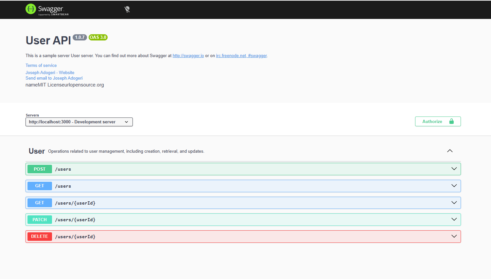
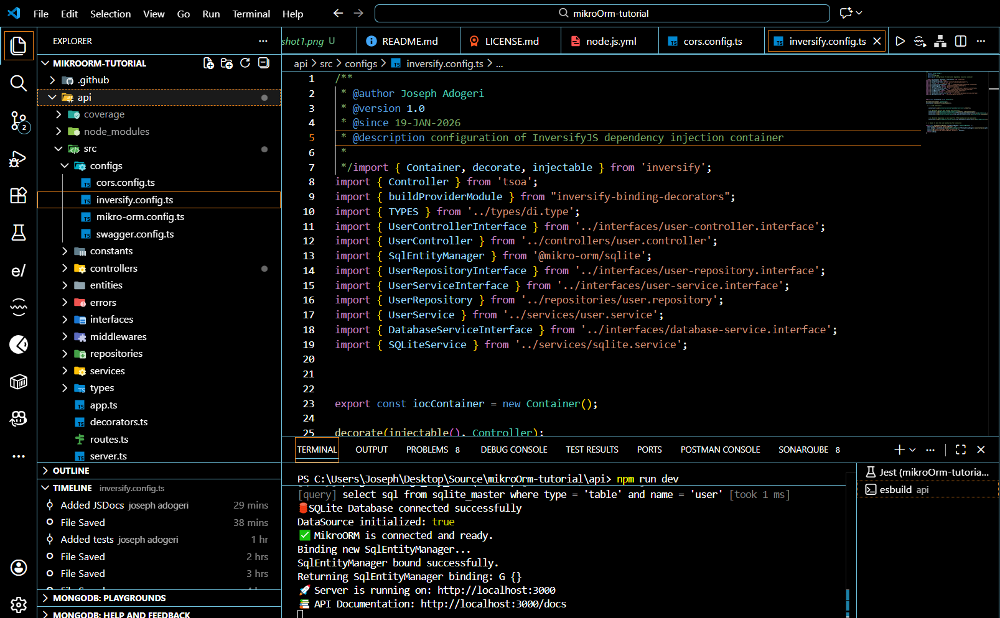
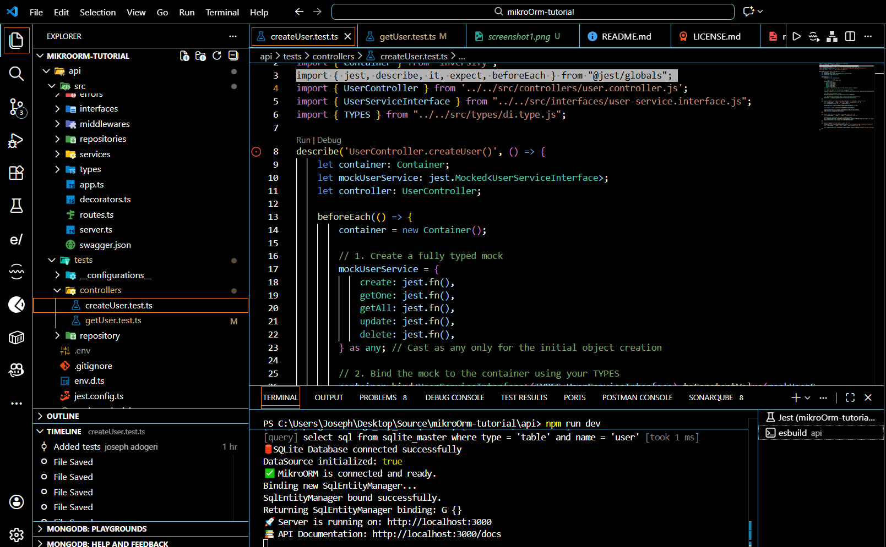
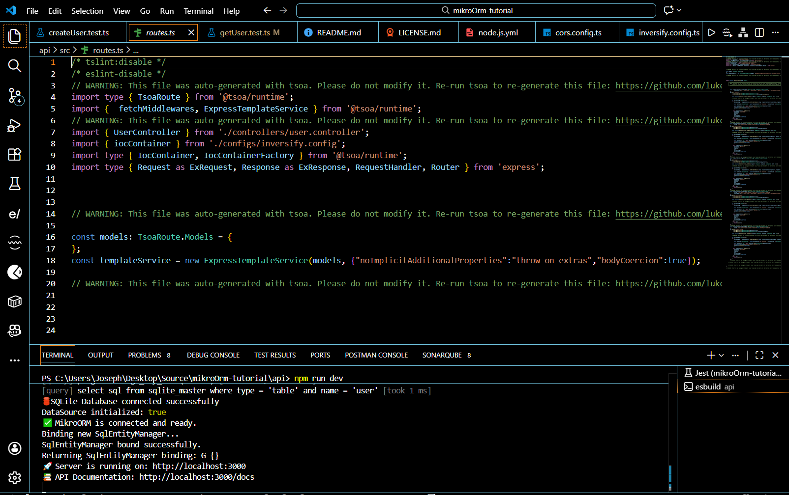
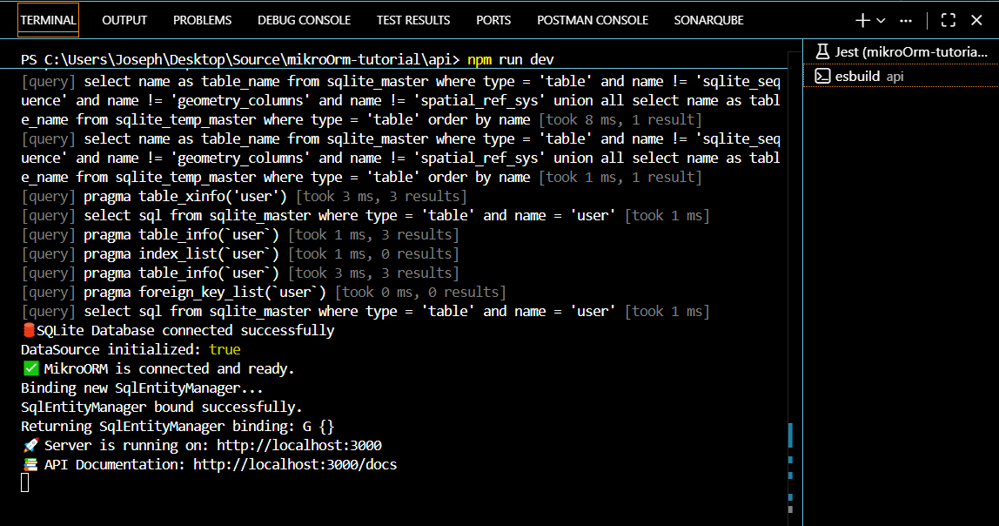
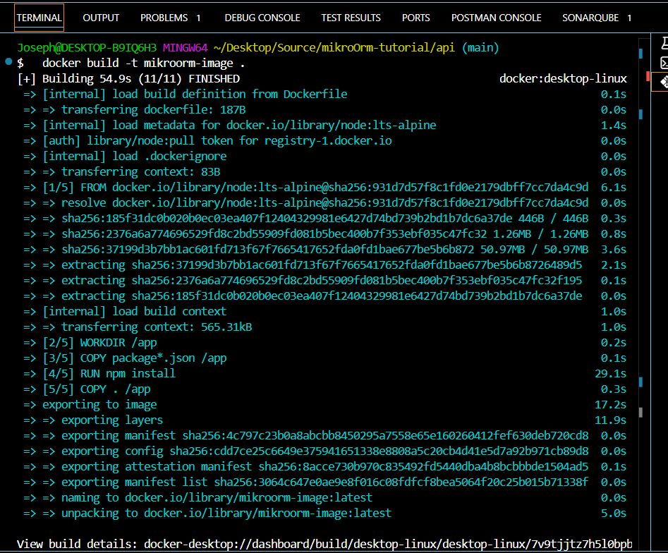
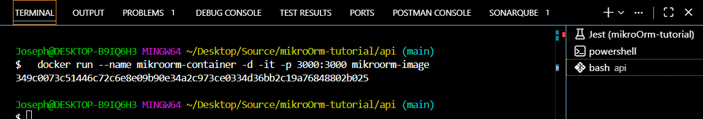
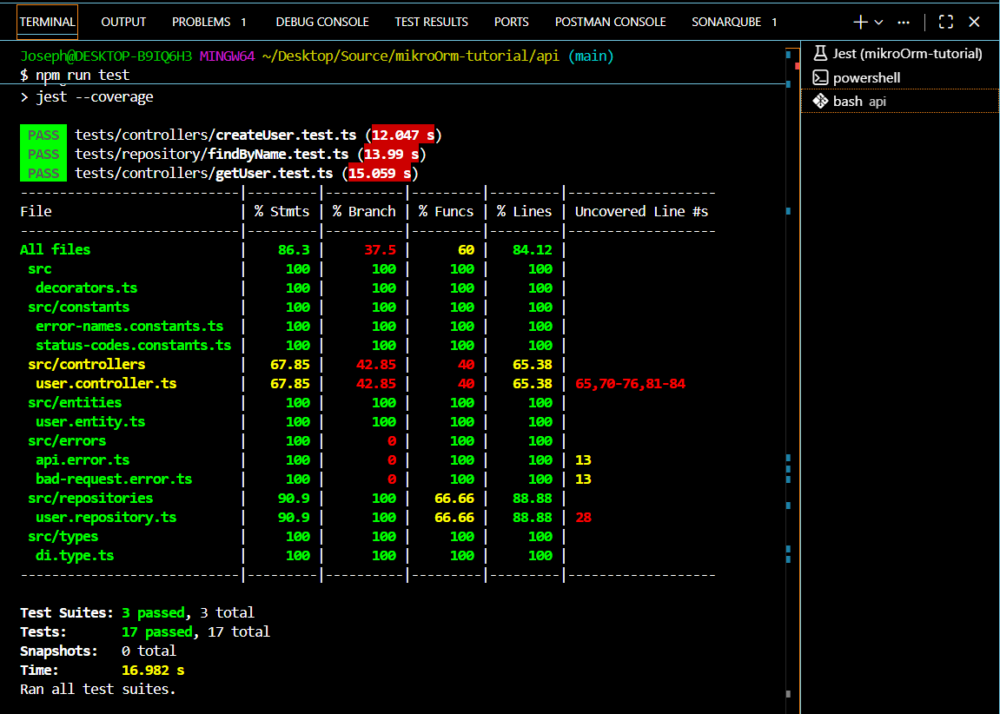
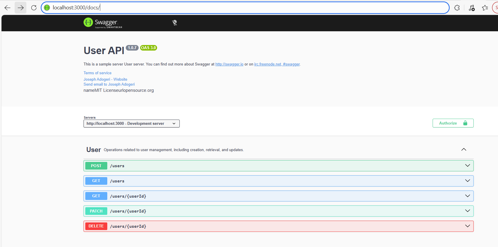

## **MIKROORM TUTORIAL**

**Version:** 1.0.0
**Date:** January 19, 2026

---


## Description

This is a beginner friendly backend application (typescript) to utilize mikroorm for mapping class to database table.

## Authors

- [@jadogeri](https://www.github.com/jadogeri)

## Repository

- [source code ](https://github.com/jadogeri/mikroOrm-tutorial.git)

## Screenshots

---

|  |  |
| -------------------------------------------- | -------------------------------------------- |
|  |  |

## Table of Contents

<ul>
      <li><a href="#1-introduction">1. Introduction</a>
        <ul>
          <li><a href="#11-purpose">1.1 Purpose</a> </li>
        </ul>
      </li>
    </ul>
     <ul>
      <li><a href="#2-installation">2. Installation</a>
      </li>
    </ul> 
     <ul>
      <li><a href="#3-technology-stack">3. Technology Stack</a>
      </li>
    </ul> 
    <ul>
        <li><a href="#4-usage">4. Usage</a>
        <ul>
            <li><a href="#41-run-application">4.1 Run Application</a> </li>
            <ul>
              <li><a href="#411-run-locally">4.1.1 Run Locally</a> </li>
              <li><a href="#412-run-docker-container">4.1.2 Run Docker Container</a> </li>
            </ul>
        </ul>
        </li>
    </ul>
    <ul> 
      <li><a href="#5-tests">5. Tests</a>
      </li>
    </ul> 
    <ul> 
      <li><a href="#6-api-documentation">6. API Documentation</a>
      </li>
    </ul> 
    <ul> 
      <li><a href="#7-references">7. References</a>
      </li>
    </ul>
</ul>

## **1. Introduction**

### **1.1 Purpose**

This document outlines the components, and design considerations for retrieving data using mikro orm.


## **2. Installation**

* [Download and install NodeJS](https://nodejs.org/en/download)

---

## **3. Technology Stack**

- **Programming Languages**: Typescript
- **IDE**: Visual Studio Code (VSCode)
- **Backend Frameworks**: MikroORM
- **Database**: SQLite
- **Container**: Docker
- **Test**: Jest 
- **Plugins**: Early AI
- **Version Control**: Git and GitHub
- **CI/CD**: GitHub Actions
- **Code Analsis**: SonarQube
- **API Documentation**: Swagger 3.0

---

## **4. Usage**

**Prerequisites** :installation of NodeJS.

### **4.1 Run Application**

1 Open command prompt or terminal.

2 Type command git clone https://github.com/jadogeri/mikroOrm-tutorial.git then press enter.

```bash
  git clone https://github.com/jadogeri/mikroOrm-tutorial.git
```

3 Enter command cd mikroOrm-tutorial/api then press enter.

```bash
  cd mikroOrm-tutorial/api
```

#### **4.1.1 Run Locally**

1 Type npm install --force to install dependencies.

```bash
  npm install --force
```

2 Type npm run dev to run application

```bash
  npm start
```

3 type or copy `http://localhost:3000` to address bar to open apollo server and run querries.



---

#### **4.1.2 Run Docker container**

1 Type docker build -t mikroorm-image . in command line to build docker image.

```bash
  docker build -t mikroorm-image .
```



2 Type docker run --name mikroorm-container -d -it -p 3000:3000 mikroorm-image to create and start container immediately.

```bash
  docker run --name mikroorm-container -d -it -p 3000:3000 mikroorm-image
```



4 Type docker stop mikroorm-container to stop container.

```bash
  docker stop mikroorm-container
```

5 Type docker start mikroorm-container to start container.

```bash
  docker start mikroorm-container
```

---
## **5. Tests**

1. run test command below.

```bash
  npm run test
```



---

## **6. API Documentation**

3 type or copy `http://localhost:3000/docs` in address bar to access API documentation.

```bash
  http://localhost:3000/docs
```


---

## **7. References**

* FreeCodeCamp : [Frontend Web Development: (HTML, CSS, JavaScript, TypeScript, React)](https://www.youtube.com/watch?v=MsnQ5uepIa).
* AweSome Open Source : [Awesome Readme Templates](https://awesomeopensource.com/project/elangosundar/awesome-README-templates)
* Readme.so : [The easiest way to create a README](https://readme.so/)
* MikroOrm : [Mikro ORM](https://mikro-orm.io/)

